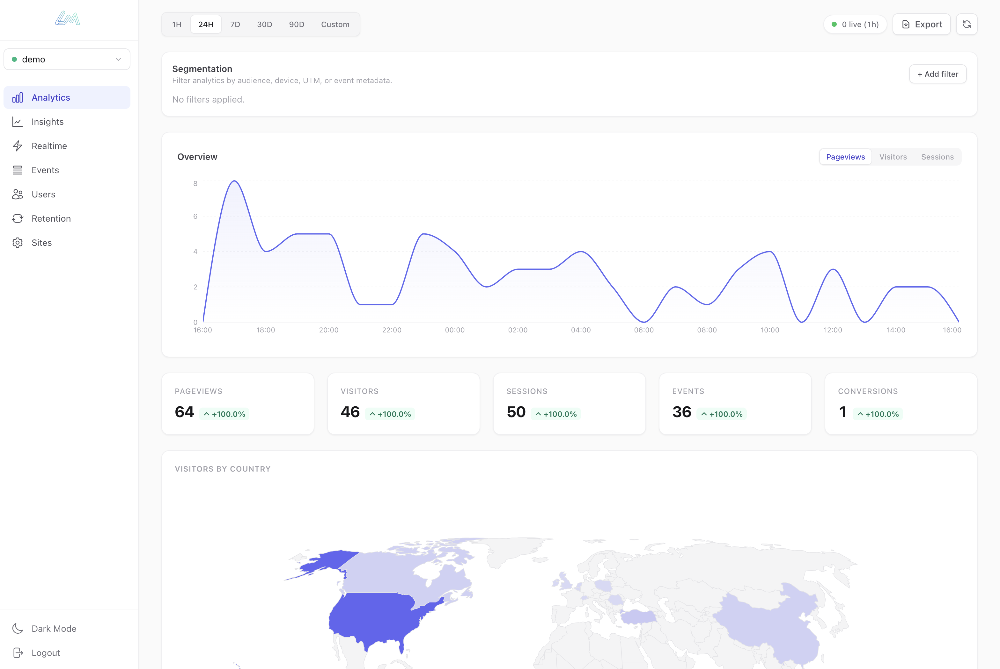

<p align="center">
  
</p>

<h1 align="center">Litemetrics</h1>

<p align="center">
  <strong>Open-source analytics you can integrate into your product.</strong><br/>
  Give your users a beautiful analytics dashboard in 5 minutes.
</p>

<p align="center">
  <a href="#quick-start">Quick Start</a> •
  <a href="#packages">Packages</a> •
  <a href="#deploy">Deploy</a> •
  <a href="#docs">Docs</a> •
  <a href="https://github.com/metehankurucu/litemetrics/issues">Issues</a>
</p>

<p align="center">
  <a href="https://railway.com/template/OQI8lX?referralCode=LpQIoM"></a>
</p>

<br/>

<p align="center">
  
</p>

<br/>

<p align="center">
  <strong>AI Agent Skill:</strong>&nbsp; <code>npx skills add metehankurucu/litemetrics</code><br/>
  <sub>Gives your AI coding agent (Claude Code, Cursor, Windsurf) full knowledge of Litemetrics integration patterns.</sub>
</p>

<br/>

## Why Litemetrics?

| | |
|---|---|
| **Embed into your product** | Drop a full analytics stack into your app — tracker, server, query API, and a pre-built dashboard UI. Your customers get analytics without you building anything. |
| **Your brand, your colors** | 10 built-in theme presets. CSS custom properties for full control. Dark mode included. Ship analytics that look like they belong in your app. |
| **Multi-tenant ready** | Each customer gets isolated analytics via `site_id`. One database, zero cross-contamination. Built for SaaS from day one. |
| **Lightweight tracker** | ~3 KB gzipped. Auto-tracks pageviews, sessions, scroll depth, button clicks, outbound links — or go fully manual. |
| **ClickHouse & MongoDB** | Choose the database that fits. ClickHouse for speed at scale, MongoDB for simplicity. Swap with one env var. |
| **One-click deploy** | Docker Compose, Railway, or a single Docker container. Up and running in under a minute. |

<br/>

## Quick Start

### 1. Add a dashboard to your app

```bash
npm install @litemetrics/ui
```

```tsx
import { LitemetricsProvider, AnalyticsDashboard } from '@litemetrics/ui';

function CustomerDashboard({ customerId }) {
  return (
    <LitemetricsProvider baseUrl="/api/stats" siteId={customerId}>
      <AnalyticsDashboard theme="midnight" />
    </LitemetricsProvider>
  );
}
```

### 2. Add tracking to your site

```html
<script src="https://your-server.com/litemetrics.js"></script>
<script>
  Litemetrics.createTracker({
    siteId: 'your-site-id',
    endpoint: 'https://your-server.com/api/collect'
  });
</script>
```

### 3. Add the server (Express)

```bash
npm install @litemetrics/node
```

```ts
import express from 'express';
import { createCollector } from '@litemetrics/node';

const app = express();
app.use(express.json());

const collector = await createCollector({
  db: { url: 'http://localhost:8123' },
});

app.all('/api/collect', (req, res) => collector.handler()(req, res));
app.all('/api/stats', (req, res) => collector.queryHandler()(req, res));

app.listen(3002);
```

> For MongoDB: `db: { adapter: 'mongodb', url: 'mongodb://localhost:27017/myapp' }`

<br/>

## Deploy

### Docker Compose (recommended)

```bash
git clone https://github.com/metehankurucu/litemetrics.git
cd litemetrics
ADMIN_SECRET=your-secret docker compose up -d
```

Open `http://localhost:3002` for the dashboard.

### Docker (standalone)

```bash
docker build -t litemetrics .
docker run -p 3002:3002 \
  -e CLICKHOUSE_URL=http://your-clickhouse:8123 \
  -e ADMIN_SECRET=your-secret \
  litemetrics
```

### Railway (one click)

1. Click the **Deploy on Railway** button above
2. Add a ClickHouse plugin (or MongoDB)
3. Set `CLICKHOUSE_URL` (or `MONGODB_URL`) and `ADMIN_SECRET`
4. Done — dashboard, API, and tracker served from one container

### Environment Variables

| Variable | Description | Default |
|----------|-------------|---------|
| `DB_ADAPTER` | Database adapter (`clickhouse` or `mongodb`) | `clickhouse` |
| `CLICKHOUSE_URL` | ClickHouse connection URL | `http://localhost:8123` |
| `MONGODB_URL` | MongoDB connection string | `mongodb://localhost:27017/litemetrics` |
| `ADMIN_SECRET` | Secret for admin access and site management | _(none)_ |
| `PORT` | Server port | `3002` |
| `GEOIP` | Enable GeoIP lookup | `true` |
| `TRUST_PROXY` | Trust X-Forwarded-For headers | `true` |

> `DATABASE_URL` and `LITEMETRICS_ADMIN_SECRET` also work as aliases.

<br/>

## Architecture

```
┌──────────────────┐         ┌──────────────────┐         ┌──────────────────┐
│                  │  POST   │                  │  GET    │                  │
│  @litemetrics/   │ /collect│  @litemetrics/   │ /stats  │  @litemetrics/   │
│  tracker         ├────────>│  node            │<────────┤  dashboard       │
│                  │         │  (collector)     │         │                  │
│  ~3KB, browser   │ events  │  ClickHouse /    │ queries │  React UI        │
│                  │         │  MongoDB         │         │                  │
└──────────────────┘         └──────────────────┘         └──────────────────┘
     Browser / App                Your Server                  Dashboard
```

The tracker handles session management, visitor IDs, batching, and SPA detection client-side. The server stores events and runs queries. The Docker image bundles everything into a single container.

<br/>

## Packages

| Package | Description |
|---------|-------------|
| [`@litemetrics/ui`](./packages/ui) | Pre-built React dashboard components (10 themes, dark mode, CSS variables) |
| [`@litemetrics/tracker`](./packages/tracker) | Browser tracker (~3 KB gzipped) |
| [`@litemetrics/node`](./packages/node) | Server collector, ClickHouse/MongoDB adapters, query API |
| [`@litemetrics/react`](./packages/react) | React provider and hooks |
| [`@litemetrics/react-native`](./packages/react-native) | React Native / Expo provider |
| [`@litemetrics/client`](./packages/client) | Typed client for reading analytics data |
| [`@litemetrics/core`](./packages/core) | Shared types and constants |

### Apps

| App | Description |
|-----|-------------|
| [`@litemetrics/dashboard`](./apps/dashboard) | Analytics dashboard (React + Vite + Tailwind) |
| [`@litemetrics/server`](./apps/server) | Self-hosted server (serves dashboard + API) |

<br/>

## Metrics

`pageviews` · `visitors` · `sessions` · `events` · `conversions` · `top_pages` · `top_referrers` · `top_countries` · `top_cities` · `top_events` · `top_conversions` · `top_exit_pages` · `top_transitions` · `top_scroll_pages` · `top_button_clicks` · `top_link_targets` · `top_devices` · `top_browsers` · `top_os` · `timeseries` · `retention`

<br/>

## Auto Events & Insights

- Auto events are tagged with `event_source=auto` and a subtype (`scroll_depth`, `button_click`, `link_click`, `outbound_click`).
- Manual `track()` events default to `event_source=manual` and `event_subtype=custom`.
- All metrics and time series support segmentation filters (geo, device, UTM, referrer, event metadata).
- The dashboard **Insights** view surfaces exit pages, transitions, scroll-heavy pages, and click hotspots.

<br/>

## Docs

- [Getting Started](./docs/getting-started.md)
- [Integration Guide](./docs/integration-guide.md) — React, React Native, Next.js, Vue, Python, PHP, Ruby, Go
- [API Reference](./docs/api-reference.md)
- [Dashboard](./docs/dashboard.md)
- [Self-Hosting](./docs/self-hosting.md)
- [Scaling](./docs/scaling.md)

<br/>

## Development

```bash
git clone https://github.com/metehankurucu/litemetrics.git
cd litemetrics
bun install
bun run build
```

<br/>

## License

MIT
