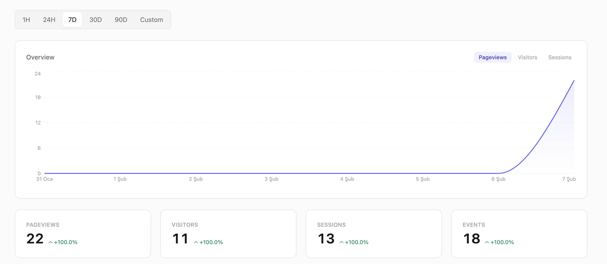
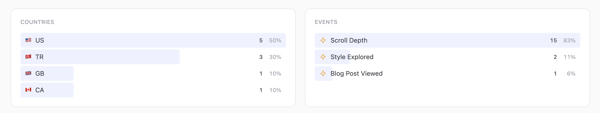

# @litemetrics/ui

Pre-built, themeable React dashboard components for [Litemetrics](https://github.com/metehankurucu/litemetrics) analytics.




## Installation

```bash
bun add @litemetrics/ui @litemetrics/client @litemetrics/core
# peer dependencies
bun add react react-dom recharts @tanstack/react-query
# optional — for WorldMap widget
bun add react-simple-maps
```

## Quick Start

```tsx
import { LitemetricsProvider, AnalyticsDashboard } from '@litemetrics/ui';

function App() {
  return (
    <LitemetricsProvider
      baseUrl="https://your-server.com"
      siteId="your-site-id"
      secretKey="sk_..."
    >
      <AnalyticsDashboard />
    </LitemetricsProvider>
  );
}
```

## Theming

All colors use CSS custom properties (`--lm-*`). The provider injects default light/dark theme variables automatically.

### Custom Accent Color

```tsx
<LitemetricsProvider
  baseUrl="..."
  siteId="..."
  theme={{ accent: '59 130 246' }}  // blue-500
>
```

### Full Custom Theme

```tsx
import type { LitemetricsTheme } from '@litemetrics/ui';

const myTheme: Partial<LitemetricsTheme> = {
  accent: '59 130 246',
  accentLight: '219 234 254',
  accentText: '29 78 216',
  bg: '255 255 255',
  text: '15 23 42',
};

<LitemetricsProvider theme={myTheme} darkTheme={{ accent: '96 165 250' }}>
```

### Dark Mode

Add `dark` class to `<html>` or any parent element:

```js
document.documentElement.classList.toggle('dark');
```

The components automatically switch to dark theme colors. You can also use `.litemetrics-light` and `.litemetrics-dark` classes for scoped theming.

## CSS Variable Reference

All values are RGB triplets (e.g. `99 102 241`). Use in your CSS as `rgb(var(--lm-accent))`.

| Variable | Light Default | Description |
|----------|--------------|-------------|
| `--lm-bg` | `255 255 255` | Primary background |
| `--lm-bg-secondary` | `250 250 250` | Secondary background |
| `--lm-bg-tertiary` | `244 244 245` | Tertiary background |
| `--lm-border` | `228 228 231` | Border color |
| `--lm-border-hover` | `212 212 216` | Border hover color |
| `--lm-text` | `24 24 27` | Primary text |
| `--lm-text-secondary` | `113 113 122` | Secondary text |
| `--lm-text-tertiary` | `161 161 170` | Tertiary text |
| `--lm-text-muted` | `212 212 216` | Muted text |
| `--lm-accent` | `99 102 241` | Accent color (indigo) |
| `--lm-accent-light` | `238 242 255` | Accent background |
| `--lm-accent-text` | `67 56 202` | Accent text |
| `--lm-accent-hover` | `129 140 248` | Accent hover |
| `--lm-positive` | `5 150 105` | Positive change |
| `--lm-negative` | `239 68 68` | Negative change |
| `--lm-chart-stroke` | `99 102 241` | Chart line color |
| `--lm-chart-fill` | `99 102 241` | Chart fill color |
| `--lm-chart-grid` | `244 244 245` | Chart grid lines |
| `--lm-chart-axis` | `161 161 170` | Chart axis text |
| `--lm-tooltip-bg` | `24 24 27` | Tooltip background |
| `--lm-tooltip-text` | `255 255 255` | Tooltip text |
| `--lm-tooltip-muted` | `161 161 170` | Tooltip secondary text |
| `--lm-bar` | `238 242 255` | Top list bar fill |
| `--lm-bar-hover` | `224 231 255` | Top list bar hover |
| `--lm-pie-1..8` | Various | Pie chart colors |
| `--lm-map-empty` | `244 244 245` | Map empty country |
| `--lm-map-stroke` | `228 228 231` | Map border |
| `--lm-map-hover` | `129 140 248` | Map hover color |

## Components

### Provider

| Prop | Type | Default | Description |
|------|------|---------|-------------|
| `baseUrl` | `string` | required | Litemetrics server URL |
| `siteId` | `string` | required | Site ID |
| `secretKey` | `string` | — | Secret key for auth |
| `defaultPeriod` | `Period` | `'7d'` | Initial time period |
| `queryClient` | `QueryClient` | — | External React Query client |
| `staleTime` | `number` | `30000` | Query stale time (ms) |
| `theme` | `Partial<LitemetricsTheme>` | — | Light theme overrides |
| `darkTheme` | `Partial<LitemetricsTheme>` | — | Dark theme overrides |

### Display Components

- **`StatCard`** — Single metric card with comparison percentage
- **`TopList`** — Ranked list with icons, bar fills, and tooltips
- **`PieChartCard`** — Donut chart with legend
- **`PeriodSelector`** — Time period toggle (1H, 24H, 7D, 30D, 90D, Custom)
- **`DateRangePicker`** — Date range inputs
- **`ExportButton`** — CSV / JSON / Markdown export

### Smart Widgets

Pre-wired to fetch data via the provider context:

- **`StatCards`** — Grid of 4 overview cards
- **`TimeSeriesChart`** — Area chart with metric selector
- **`TopPages`**, **`TopReferrers`**, **`TopCountries`**, **`TopEvents`**, **`TopBrowsers`**, **`TopDevices`**
- **`BrowsersChart`**, **`DevicesChart`** — Pie chart variants
- **`WorldMap`** — Interactive choropleth map (requires `react-simple-maps`)
- **`AnalyticsDashboard`** — Complete dashboard combining all widgets

## Hooks

| Hook | Description |
|------|-------------|
| `useLitemetricsUI()` | Access provider context (client, period, etc.) |
| `useStats(metric, opts?)` | Query stats for a specific metric |
| `useTimeSeries(metric, opts?)` | Query time series data |
| `useOverview(opts?)` | Query overview with period comparison |
| `useThemeColors()` | Get theme colors for SVG/Recharts (auto-updates on dark mode toggle) |

## Peer Dependencies

| Package | Version |
|---------|---------|
| `react` | >=18 |
| `react-dom` | >=18 |
| `recharts` | >=2 |
| `@tanstack/react-query` | >=5 |
| `tailwindcss` | >=3 (optional) |
| `react-simple-maps` | >=3 (optional, for WorldMap) |

## License

MIT
